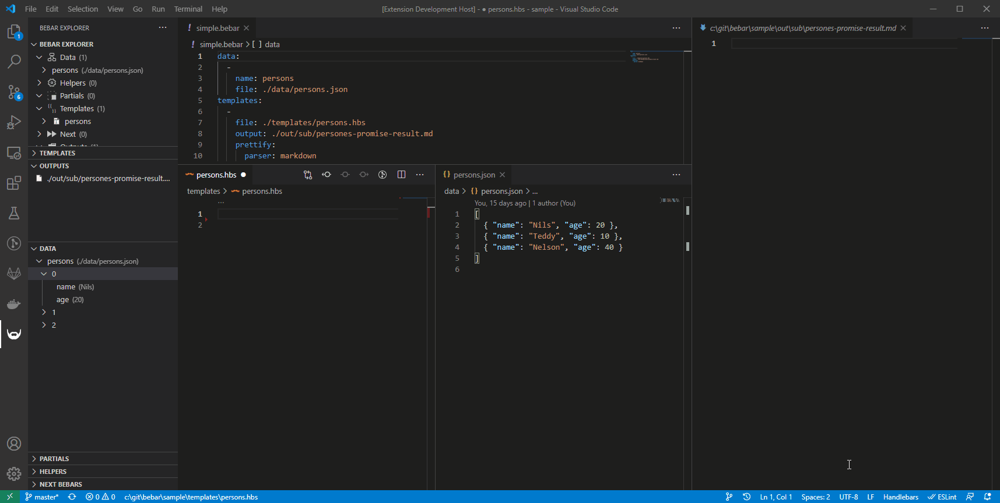

# bebar README

Bebar is an extension to help you format data using templates.

Bebar is mainly a "glue" between a data source, a mustache template, and an output filename that lets you for example:
- transform a json file to a more readable markdown file,
- transform swagger files into source code,
- load data from an external service, and format it into an html file
- ...

Bebar uses [Handlebars](https://handlebarsjs.com/) templating syntax.

## Features

This extension allows you to browse your bebar files, edit template and preview outputs in real time.

You basically create a .bebar file that indicates which data file (json, yaml and more) you wish to transform using particular (mustache) templates.

- **Need to produce an html file using data from a json file?**
- **Need to generate typescript files from a swagger file?**
- **Need to generate insert sql scripts from a database table?**
- **...**

All of these things are possible with Bebar!

Open a mustache file on one side, and preview it's result in live on the other side!

A full complete guide on how to use Bebar can be found **[here](https://github.com/oYo-fr/bebar)**.

## Release Notes

### 0.0.01

Initial release
